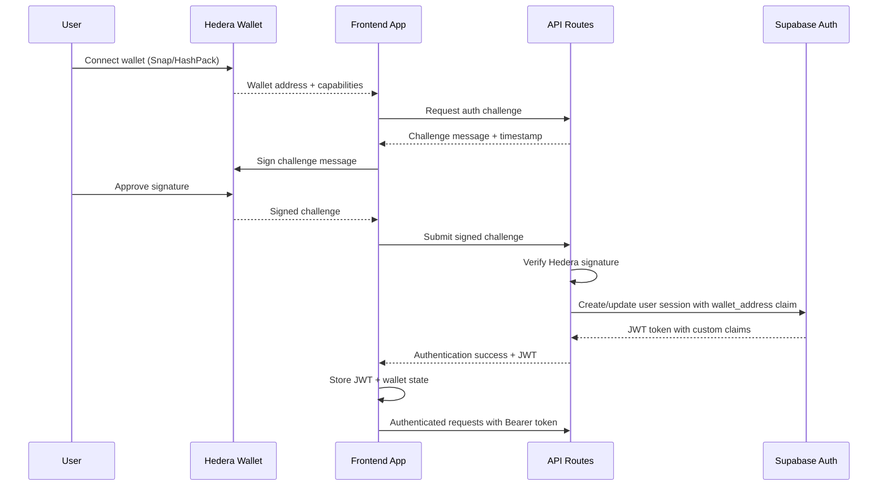

# Backend Architecture

## Service Architecture - Next.js API Routes + Edge Functions

**Function Organization:**

```
pages/api/
├── hedera/
│   ├── hcs/
│   │   └── log-event.ts         # Serverless Function
│   └── mirror-node/
│       └── [productId].ts       # Edge Function (performance critical)
├── products/
│   ├── [id].ts                  # Edge Function
│   └── index.ts                 # Serverless Function (batch creation)
├── compliance/
│   ├── validate-action.ts       # Serverless Function (replaces Guardian policy)
│   ├── carbon-credit.ts         # Serverless Function (carbon credit validation)
│   └── supply-chain.ts          # Serverless Function (supply chain verification)
└── regulatory/
    └── compliance.ts            # Serverless Function
```

**Function Template:**

```typescript
// Edge Function template for performance-critical operations
import { NextRequest, NextResponse } from 'next/server';
import { HederaMirrorClient } from '@/lib/hedera';

export const runtime = 'edge';

export default async function handler(req: NextRequest) {
  try {
    const productId = req.nextUrl.pathname.split('/').pop();

    if (!productId) {
      return NextResponse.json(
        {
          error: { code: 'INVALID_PRODUCT_ID', message: 'Product ID required' },
        },
        { status: 400 }
      );
    }

    // Direct Mirror Node query for sub-30s performance
    const mirrorClient = new HederaMirrorClient();
    const productData = await mirrorClient.getProduct(productId);

    return NextResponse.json(productData, {
      headers: {
        'Cache-Control': 'public, max-age=30', // 30-second cache
        'X-Edge-Function': 'true',
      },
    });
  } catch (error) {
    return NextResponse.json(
      { error: { code: 'MIRROR_NODE_ERROR', message: error.message } },
      { status: 500 }
    );
  }
}
```

**Custom Compliance Engine Template (Replaces Guardian):**

```typescript
// pages/api/compliance/validate-action.ts
import { NextApiRequest, NextApiResponse } from 'next';
import { withWalletAuth } from '@/lib/auth';
import { HederaService } from '@/lib/hedera';

interface ComplianceRule {
  id: string;
  type: 'supply_chain' | 'carbon_credit' | 'regulatory';
  conditions: Record<string, any>;
  actions: string[];
}

export default withWalletAuth(async (req, res, context) => {
  const { action, data, productId } = req.body;

  try {
    // Load compliance rules based on action type
    const rules = await loadComplianceRules(action);

    // Validate against business logic (replaces Guardian policy)
    const validationResult = await validateAction(rules, data, context);

    if (!validationResult.isValid) {
      return res.status(400).json({
        error: {
          code: 'COMPLIANCE_VIOLATION',
          message: validationResult.reason,
          violations: validationResult.violations,
        },
      });
    }

    // Log compliance check to HCS (maintain audit trail)
    const hederaService = new HederaService(context.walletAddress);
    await hederaService.logComplianceEvent({
      action,
      productId,
      result: 'APPROVED',
      timestamp: new Date().toISOString(),
      walletAddress: context.walletAddress,
    });

    return res.json({
      approved: true,
      complianceId: validationResult.complianceId,
    });
  } catch (error) {
    return res.status(500).json({
      error: { code: 'COMPLIANCE_ERROR', message: error.message },
    });
  }
});

async function loadComplianceRules(
  actionType: string
): Promise<ComplianceRule[]> {
  // Custom business logic - replaces Guardian policy engine
  switch (actionType) {
    case 'supply_chain_verification':
      return [
        {
          id: 'organic_certification_required',
          type: 'supply_chain',
          conditions: { certificationRequired: true },
          actions: ['verify_organic_certificate', 'check_chain_integrity'],
        },
      ];
    case 'carbon_credit_issuance':
      return [
        {
          id: 'carbon_measurement_validation',
          type: 'carbon_credit',
          conditions: { minimumMeasurements: 3, verificationPeriod: 30 },
          actions: ['validate_measurements', 'verify_baseline'],
        },
      ];
    default:
      return [];
  }
}

async function validateAction(
  rules: ComplianceRule[],
  data: any,
  context: AuthContext
): Promise<ValidationResult> {
  // Implement custom validation logic
  // This replaces Guardian's policy execution engine
  const violations: string[] = [];

  for (const rule of rules) {
    const ruleResult = await executeRule(rule, data, context);
    if (!ruleResult.passed) {
      violations.push(ruleResult.violation);
    }
  }

  return {
    isValid: violations.length === 0,
    violations,
    complianceId: `comp_${Date.now()}`,
    reason: violations.length > 0 ? violations.join(', ') : null,
  };
}
```

## Authentication and Authorization

**Auth Flow:**



**Auth Middleware:**

```typescript
// Next.js API middleware for wallet authentication
export async function withWalletAuth<T>(
  handler: (
    req: NextApiRequest,
    res: NextApiResponse,
    context: AuthContext
  ) => Promise<T>
) {
  return async (req: NextApiRequest, res: NextApiResponse) => {
    try {
      const token = req.headers.authorization?.replace('Bearer ', '');

      if (!token) {
        return res.status(401).json({
          error: {
            code: 'WALLET_NOT_CONNECTED',
            message: 'Wallet authentication required',
          },
        });
      }

      // Verify JWT and extract wallet address
      const supabase = createServiceRoleClient();
      const {
        data: { user },
        error,
      } = await supabase.auth.getUser(token);

      if (error || !user) {
        return res.status(401).json({
          error: {
            code: 'INVALID_SIGNATURE',
            message: 'Invalid authentication',
          },
        });
      }

      const walletAddress = user.user_metadata?.wallet_address;
      const userRole = user.user_metadata?.role;

      const context: AuthContext = {
        walletAddress,
        userRole,
        isAuthenticated: true,
      };

      return handler(req, res, context);
    } catch (error) {
      return res.status(500).json({
        error: { code: 'AUTH_ERROR', message: 'Authentication failed' },
      });
    }
  };
}
```

---
