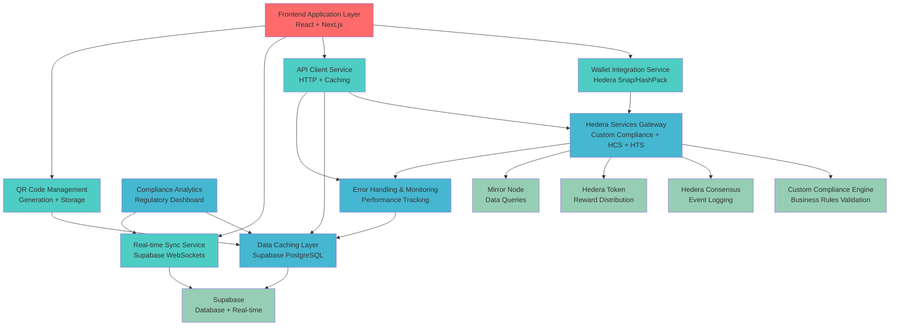

# Components

Based on the architectural patterns, tech stack, and data models established above, the major logical components across the fullstack system provide clear separation of concerns and maintainable interfaces:

## Frontend Application Layer

**Responsibility:** User interface and experience management for all ChainTrace user types (consumers, cooperative managers, regulatory officers)

**Key Interfaces:**

- React component tree with TypeScript props interfaces
- Zustand state management stores for global application state
- Next.js App Router for page routing and navigation
- Tailwind CSS design system components

**Dependencies:** Wallet Integration Service, API Client Service, Real-time Sync Service

**Technology Stack:** Next.js 14, React, TypeScript, Tailwind CSS, Headless UI

## Wallet Integration Service

**Responsibility:** Secure delegation of all private key operations to user's Hedera wallet (Snap or HashPack) with seamless authentication flow

**Key Interfaces:**

- `connectWallet()` - Initiate wallet connection and authentication
- `signTransaction(transaction)` - Delegate HCS/HTS operations to wallet
- `getAccountInfo()` - Retrieve user's Hedera account details and balance
- `subscribeToAccountUpdates()` - Real-time account balance and transaction updates

**Dependencies:** Hedera Wallet Snap, HashPack SDK, Browser APIs

**Technology Stack:** @hashgraph/hedera-wallet-snap, hashconnect, TypeScript event handling

## API Client Service

**Responsibility:** Centralized HTTP client for all backend API communications with error handling, retry logic, and performance optimization

**Key Interfaces:**

- `products.getById(id)` - Product verification lookup with caching
- `products.createBatch(batch)` - Cooperative product batch creation
- `events.create(event)` - Supply chain event logging
- `regulatory.getComplianceOverview()` - Dashboard data aggregation
- `tokens.getRewardHistory(address)` - HTS token reward history

**Dependencies:** Next.js API Routes, Fetch API, Cache Management

**Technology Stack:** TypeScript, Zod validation, SWR/TanStack Query for caching

## Hedera Services Gateway

**Responsibility:** Server-side integration with Hedera Hashgraph services including Custom Compliance Engine, HCS logging, HTS token distribution, and Mirror Node queries

**Implementation:** **Next.js API Routes deployed as Vercel Serverless Functions** for standard operations, with **Vercel Edge Functions** for performance-critical Mirror Node queries requiring sub-30 second responses

**Key Interfaces:**

- `POST /api/compliance/validate-action` - Supply chain workflow compliance validation
- `POST /api/hedera/hcs/log-event` - Immutable event logging to consensus service
- `POST /api/hedera/hts/distribute-rewards` - Token reward distribution
- `GET /api/hedera/mirror-node/product/{id}` - Fast product data retrieval (Edge Function)

**Dependencies:** Hedera SDK, Custom Compliance Engine APIs, Wallet Integration Service for signatures

**Technology Stack:** Next.js API Routes, Vercel Serverless/Edge Functions, @hashgraph/sdk, TypeScript

## Real-time Sync Service

**Responsibility:** Live dashboard updates and cache synchronization using Supabase real-time WebSocket connections for instant UI updates

**Key Interfaces:**

- `subscribeToComplianceUpdates()` - Regulatory dashboard live updates
- `subscribeToProductEvents()` - New verification events across products
- `subscribeToTokenRewards()` - HTS token distribution notifications
- `subscribeToBatchStatus()` - Cooperative product batch status changes

**Dependencies:** Supabase Real-time, WebSocket APIs, State Management

**Technology Stack:** Supabase JavaScript SDK, TypeScript, Zustand integration

## Data Caching Layer

**Responsibility:** Performance optimization through intelligent caching of Mirror Node responses and frequently accessed verification data

**Current Implementation (MVP):** **Supabase PostgreSQL with optimized queries and indexing** - provides relational data benefits and real-time sync capabilities essential for hackathon reliability

**Future Production Enhancement:** **Redis/Upstash integration** for sub-100ms cache responses and reduced database load, maintaining Supabase for persistent data and real-time subscriptions

**Key Interfaces:**

- `cache.get(key)` - Retrieve cached data with automatic fallback chain
- `cache.set(key, data, ttl)` - Multi-tier cache population strategy
- `cache.invalidate(pattern)` - Coordinated cache clearing across tiers

**Technology Stack:** Supabase PostgreSQL (current), Upstash Redis (future), TypeScript

## Error Handling and Monitoring Service

**Responsibility:** **Cross-cutting error management and performance monitoring** injected into all backend services and frontend components for comprehensive system observability

**Integration Pattern:** **Service injection and middleware pattern** ensuring consistent error handling across all system components

**Key Interfaces:**

- `withErrorHandling(operation)` - Higher-order function wrapping all operations
- `logStructuredError(error, context, service)` - Consistent error logging across services
- `trackServiceHealth(serviceName, operation, duration)` - Performance monitoring injection
- `notifyOnCriticalFailure(threshold, service)` - Alert system integration

**Dependencies:** **Injected by all other backend services** rather than depending on them, ensuring proper inversion of control

**Technology Stack:** TypeScript decorators/HOFs, Vercel Analytics, structured console logging

## Component Diagrams

