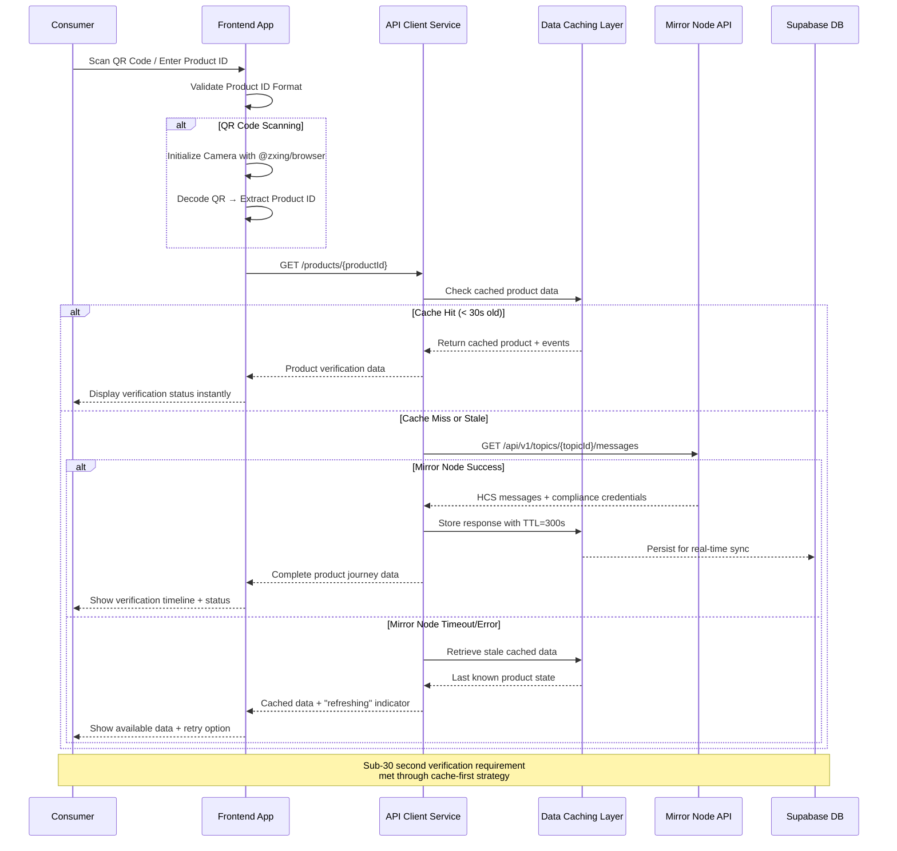
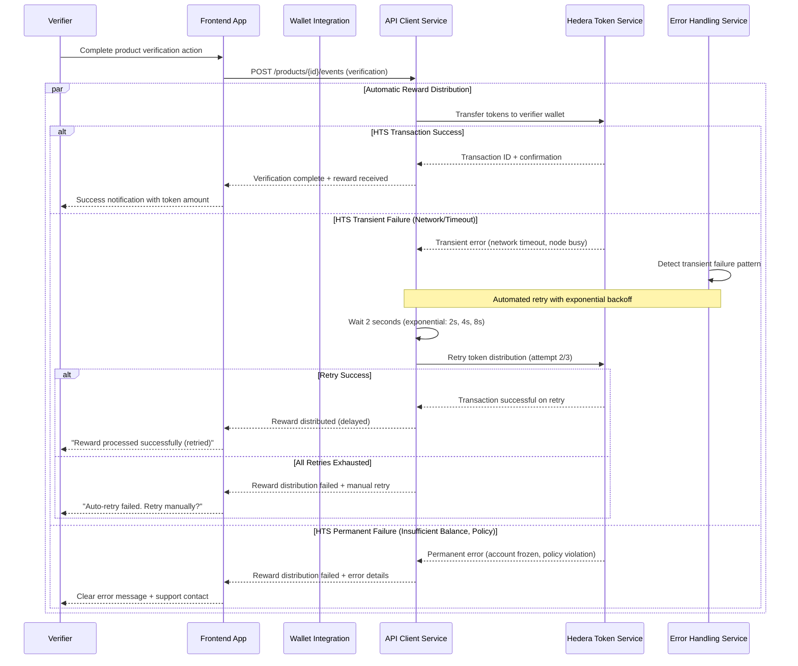
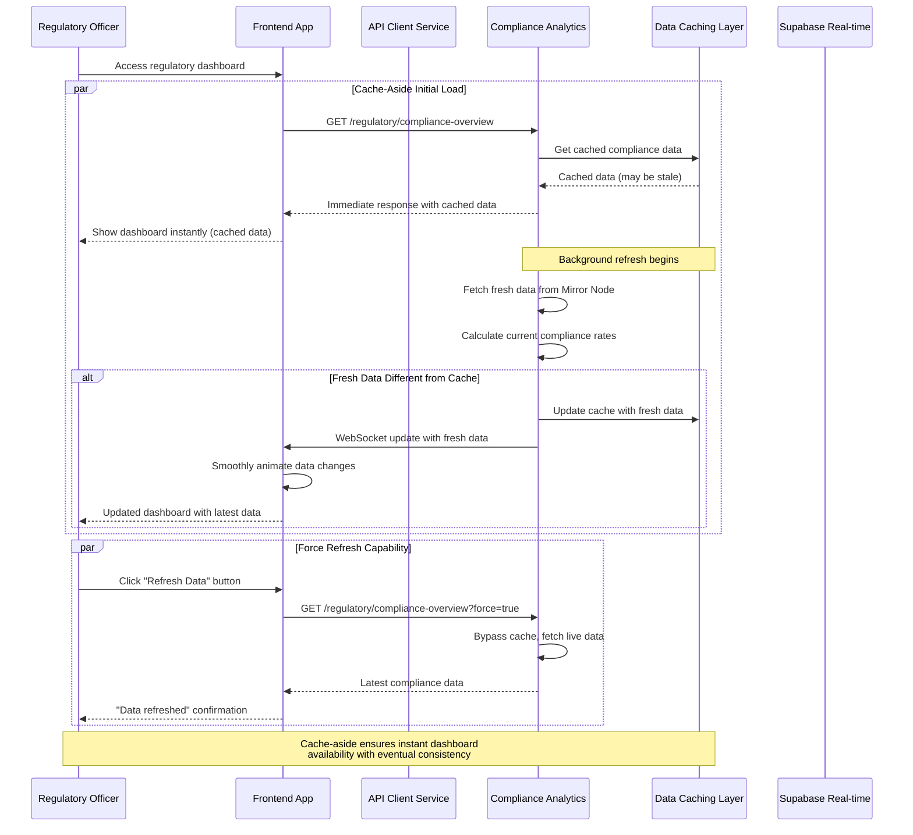

# Core Workflows

The following sequence diagrams illustrate key system workflows showing component interactions, external API integrations, and error handling paths:

## Consumer Product Verification Workflow

## Token Reward Distribution with Automated Retry

## Regulatory Dashboard with Cache-Aside Pattern

