# High Level Architecture

## Technical Summary

ChainTrace implements a **secure wallet-delegated architecture** with **Hedera Wallet Snap/HashPack integration** for all private key operations, utilizing **Next.js with React** for the frontend and **optimized serverless functions** for performance-critical operations. The architecture leverages **Hedera's core services ecosystem** (HCS, HTS, Mirror Node) with **custom compliance logic** while delegating all sensitive operations to users' secure wallets, eliminating private key storage risks. **Vercel deployment** with **performance monitoring for cold start mitigation** ensures reliable sub-30 second verification through **hybrid client-direct and cached Mirror Node integration**. This approach maintains enterprise-grade security through wallet delegation while establishing a foundation for post-MVP expansion.

## Platform and Infrastructure Choice

**Recommendation: Vercel + Supabase + Hedera Wallet Integration**

**Rationale**: Wallet delegation eliminates private key security risks while Vercel's edge distribution optimizes global performance. Supabase provides real-time caching to reduce Mirror Node dependency and mitigate cold start impacts through pre-warmed data.

**Platform:** Vercel (Frontend + Selective Edge Functions) + Supabase (Caching/Real-time) + Hedera Wallet Snap/HashPack  
**Key Services:** Vercel Edge Network, Supabase PostgreSQL + Realtime, Hedera Wallet Snap, HashPack Wallet, Mirror Node API  
**Deployment Host and Regions:** Vercel Global Edge Network, Primary: US-East (Hedera node proximity)

## Repository Structure

**Structure:** Next.js Monorepo with Wallet Integration  
**Monorepo Tool:** Next.js built-in  
**Package Organization:** Apps (web), Packages (wallet-connectors, hedera-types), Lib (services, components, utils)

## High Level Architecture Diagram

```mermaid
graph TB
    %% User Entry Points
    Consumer[Consumer<br/>Mobile/Desktop Browser]
    Manager[Cooperative Manager<br/>Web Dashboard]
    Regulator[Regulatory Officer<br/>Admin Dashboard]

    %% Wallet Layer (NEW)
    Consumer --> Wallet[Hedera Wallet Snap<br/>or HashPack Wallet]
    Manager --> Wallet
    Regulator --> Wallet

    %% Frontend Layer
    Consumer --> WebApp[Next.js Web Application<br/>Vercel Edge Network]
    Manager --> WebApp
    Regulator --> WebApp

    %% Wallet Integration
    WebApp <--> WalletAPI[Wallet API Integration<br/>Secure Key Operations]
    WalletAPI <--> Wallet

    %% Application Services (OPTIMIZED)
    WebApp --> Cache[(Supabase PostgreSQL<br/>Mirror Node Cache + Real-time)]
    WebApp --> EdgeAPI[Vercel Edge Functions<br/>Performance Critical Only]

    %% Direct Client Connections (NEW)
    WebApp --> Mirror[Mirror Node API<br/>Direct Client Queries]

    %% Hedera Services via Wallet
    WalletAPI --> Compliance[Custom Compliance Engine<br/>Business Logic & Validation]
    WalletAPI --> HCS[Hedera Consensus Service<br/>Event Logging]
    WalletAPI --> HTS[Hedera Token Service<br/>Reward Distribution]

    %% Data Flow
    Mirror --> Cache
    Cache --> WebApp

    %% Performance Monitoring (NEW)
    WebApp --> Monitor[Vercel Analytics<br/>Cold Start Monitoring]
    EdgeAPI --> Monitor

    %% Styling
    classDef hedera fill:#4A90E2
    classDef vercel fill:#000
    classDef supabase fill:#3ECF8E
    classDef user fill:#FF6B6B
    classDef wallet fill:#9B59B6
    classDef compliance fill:#FF9500

    class HCS,HTS,Mirror hedera
    class WebApp,EdgeAPI,Monitor vercel
    class Cache supabase
    class Consumer,Manager,Regulator user
    class Wallet,WalletAPI wallet
    class Compliance compliance
```

## Architectural Patterns

- **Wallet-First Security Pattern:** All private key operations delegated to user's secure wallet (Hedera Wallet Snap/HashPack) - _Rationale:_ Eliminates private key storage/transmission risks while maintaining user control and industry-standard security practices

- **Hybrid Performance Pattern:** Direct client Mirror Node queries + Supabase caching with selective Edge Functions - _Rationale:_ Mitigates cold start impact on critical verification path while maintaining sub-30 second performance requirements

- **Progressive Enhancement Pattern:** Core functionality works with direct wallet connection, Edge Functions enhance UX when warm - _Rationale:_ Ensures demonstration reliability regardless of cold start conditions

- **Event-Driven Architecture:** HCS message logging drives state changes with real-time Supabase sync - _Rationale:_ Maintains audit trail integrity while enabling instant dashboard updates

- **Circuit Breaker with Cache-First Pattern:** Supabase cache serves verification requests when Mirror Node is slow - _Rationale:_ Critical for meeting sub-30 second requirements during demonstrations
